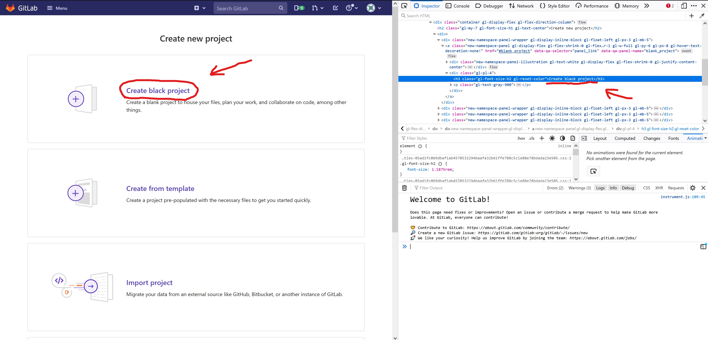

## Summary (Summarize the bug encountered concisely)
    When user is creating a new project in the page https://gitlab.com/projects/new the section where user can create a blank project has a wrong title: "Create black project" when it should be "Create blank project".

## Steps to reproduce
    Open browser
    Go to https://about.gitlab.com/
    Click Login https://gitlab.com/users/sign_in
    Enter your account credentials and click Sign in
    Click New project button https://gitlab.com/projects/new
     
## What is the current bug behavior?

    The section where user can click to create a blank project has a title "Create a black project".

## What is the expected correct behavior?

    The section's title should be "Create a blank project".
     
## Relevant screenshots

## Possible fixes

    The <h3> -tag that contains the typo can be edited to have the correct title. Navigate to the correct 
 -block shown in the screenshot above and change "black" to "blank".
